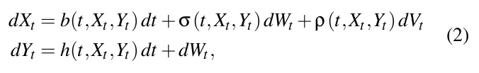
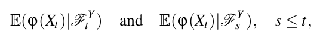
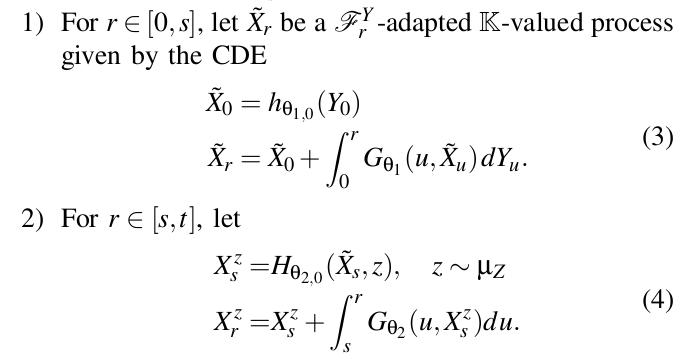
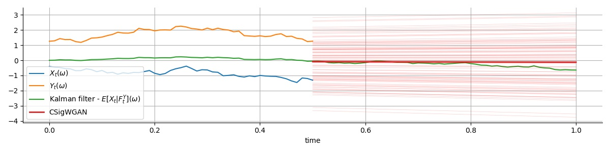

# Learning the conditional Law. Filtering and Prediction

Code for the paper [Learning the conditional law: signatures and conditional GANs in filtering and prediction of diffusion processes](https://arxiv.org/abs/2204.00611).
Abstract:

           We consider the filtering and prediction problem for a diffusion process. The signal and observation are modeled by stochastic differential
           equations (SDEs) driven by Wiener processes. In classical estimation theory, measure-valued stochastic partial differential equations (SPDEs)
           are derived for the filtering and prediction measures. These equations can be hard to solve numerically. We provide an approximation algorithm
           using conditional generative adversarial networks (GANs) and signatures, an object from rough path theory. The signature of a sufficiently
           smooth path determines the path completely. In some cases, GANs based on signatures have been shown to efficiently approximate the law of a 
           stochastic process. In this paper we extend this method to approximate the prediction measure conditional to noisy observation. We use 
           controlled differential equations (CDEs) as universal approximators to propose an estimator for the conditional and prediction law. We show
           well-posedness in providing a rigorous mathematical framework. Numerical results show the efficiency of our algorithm.


## The problem
Consider the signal-observation system where the coefficients are assumed to be regular enough (see Assumption 2.1 of the [paper](https://arxiv.org/abs/2204.00611). 



The goal of filtering and prediction is to derive and analyze the quantities



i.e. we train a generator that is able to sample from the conditional law, and we approximate the above quantities using averages and law of large numbers. 

## The method
For this, we use the [Conditional Sig-Wasserstein GAN](https://arxiv.org/abs/2006.05421), using the following Neural Differential Equations for the Generator



The generator is well posed. (3) is motivate by the Martingale representation of an Ft^Y-adapted process, and (4) parametrizes the rate of change of the mean prospective transition, [Lemma 4.2](https://arxiv.org/abs/2006.05421).

## The code
Relevant scripts:
 
- [lib/nde.py](lib/nde.py) parametrizes the Neural CDE and Neural ODE of the generator. They are solved using [torchcde](https://github.com/patrick-kidger/torchcde) and [torchdiffeq](https://github.com/rtqichen/torchdiffeq) respectively.
- [lib/sigcwgan.py](lib/sigcwgan.py) implements the sigcwgan class and its fitting methods. 
- [lib/data.py](lib/data.py) creates a synthetic dataset from the SDE using Euler method. To be changed for new SDEs. This script also implements the Kalman filter in the linear case. 

*Requirements*: to set up the environment:
```
conda env create -f environment.yml
```


*Training*:
```python
usage: train.py [-h] [--base_dir BASE_DIR] [--device DEVICE] [--use_cuda] [--seed SEED]
                [--num_epochs NUM_EPOCHS] [--depth DEPTH] [--T T] [--n_steps N_STEPS]
                [--window_length WINDOW_LENGTH]

optional arguments:
  -h, --help            show this help message and exit
  --base_dir BASE_DIR   base dir for results
  --device DEVICE       gpu id if cuda is available
  --use_cuda
  --seed SEED
  --num_epochs NUM_EPOCHS
  --depth DEPTH         depth of signature
  --T T
  --n_steps N_STEPS     number of steps in time discretisation
  --window_length WINDOW_LENGTH
                        window length used in log-ODE method

```
*Evaluation*. Right now there is only evaluation in the linear case, using the Kalman filter.
```python
usage: evaluate.py [-h] [--base_dir BASE_DIR] [--device DEVICE] [--use_cuda] [--seed SEED] [--depth DEPTH] [--T T] [--n_steps N_STEPS] [--window_length WINDOW_LENGTH]

optional arguments:
  -h, --help            show this help message and exit
  --base_dir BASE_DIR   base dir for results
  --device DEVICE       gpu id if cuda is available
  --use_cuda
  --seed SEED
  --depth DEPTH         depth of signature
  --T T
  --n_steps N_STEPS     number of steps in time discretisation
  --window_length WINDOW_LENGTH
                        window length used in log-ODE method
```
Plots are saved in the value given to `args.base_dir`, which is `numerical_results` by default. 




### TODOs
- Code the splitting-up yo solve the Zakai eq for evaluation
    - PDE solver (FEM or DL in higher dims)
    - Sampling from an unnormalised density (MALA, MCMC, Langevin? --> need the gradient of the sol of the zakai equation, ugh)
- Solve the forward kolmogorov eq for transition prob
   
- Jumps in the diffusion proces --> the generator will need to be changed. There is always interpolation in the driver of the CDE/rough neural differential equation, so eventually everything is always of bounded variation.... ODE-RNN method for the generator? What about the discriminator?
- Control problems...

 
